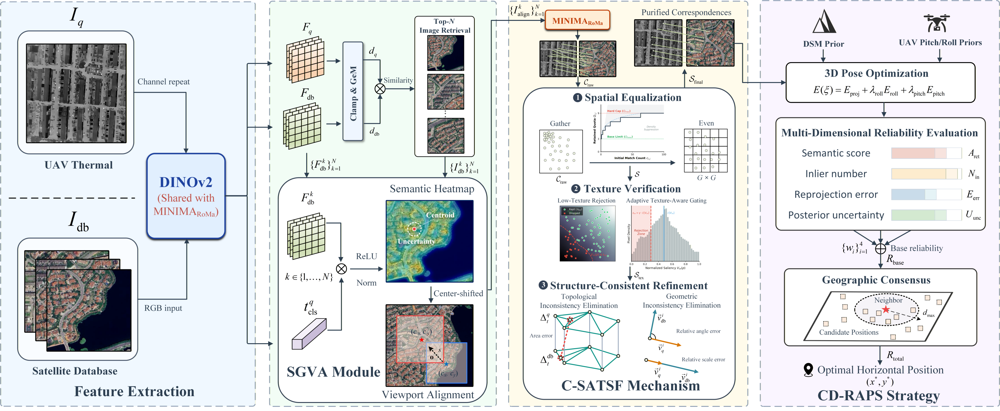
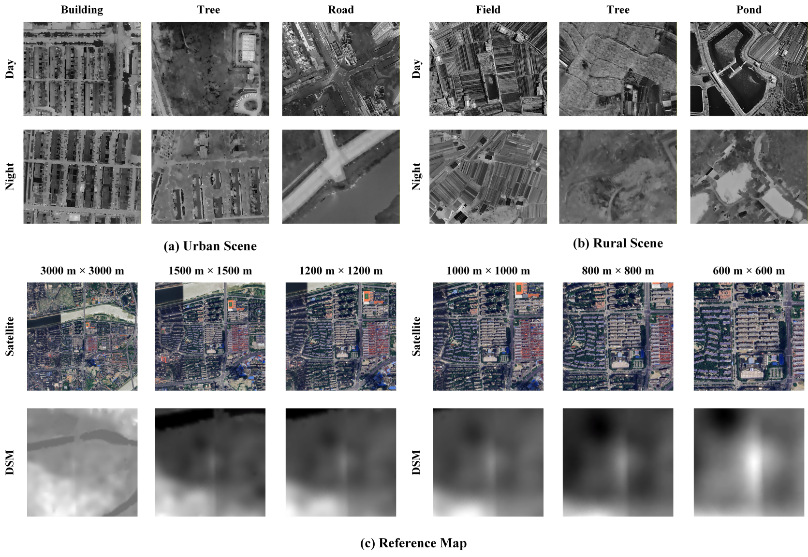

<div align="center">
  
  <br><br>
  <h1>SCC-Loc: A Unified Semantic Cascade Consensus Framework for UAV Thermal Geo-Localization</h1>
  <p>
    If you find our work useful, please consider giving us a ⭐️. 
    Your support means a lot to us! 🥰
  </p>
</div>

## Framework

</p>
<div align="center">
  
</div>

🎯 We present a unified Semantic-Cascade-Consensus framework (SCC-Loc) for cross-modal UAV thermal geo-localization in GNSS-denied environments.
This approach is particularly useful for overcoming the profound modality gap between onboard thermal imagery and visible-light satellite maps, which typically causes spatial quantization biases, dense structural outliers, and deceptive visual decoys during pose estimation. By seamlessly integrating a shared DINOv2 backbone with our Semantic-Guided Viewport Alignment (SGVA) module, Cascaded Spatial-Adaptive Texture-Structure Filtering (C-SATSF) mechanism, and Consensus-Driven Reliability-Aware Position Selection (CD-RAPS) strategy, we achieve zero-shot, highly accurate absolute pose estimation without the need for domain-specific training.
We also construct Thermal-UAV, a comprehensive cross-modal benchmark dataset comprising 11,890 thermal images that capture complex urban-rural topologies and multi-temporal (day-night) variations, paired with satellite ortho-photos and spatially aligned Digital Surface Models (DSMs). This dataset addresses current data scarcity and serves as a robust resource for evaluating all-weather UAV positioning algorithms.

## Dataset

<div align="center">
  
</div>

🀄 We construct the **Thermal-UAV** dataset which comprised 11,890 Thermal UAV images  (nadir view, multi-time, multi- scenario, flight sequence composition) using the DJI Matrice 4T drone around changsha. We split it as three sets: training (8,115), validation (1,425), and testing (2,350). Meanwhile, we collect the  0.26 m/px Google map and 5.29 m/px Digital Surface Model (DSM). The structure of Thermal-UAV is shown as follows:

```text
Data/
├── metadata/
│   ├── train_Thermal.json
│   ├── valid_Thermal.json
│   └── test_Thermal.json
├── Reference_map/
│   └── changsha/
│       ├── ref.tif
│       └── dsm.tif
└── Thermal-UAV/
  ├── train/
  │   └── changsha/
  │       └── <place_name>/
  │           └── Thermal/
  │               ├── xxx1.JPG
  │               ├── xxx2.JPG
  |		  └── ...
  |	      └──  Thermal_info.csv
  ├── valid/
  └── test/
```

The Thermal-UAV dataset and checkpoint are provided in [Baidu Netdisk](https://pan.baidu.com/s/1gORHGMLm3yQ75tCFmCPQLQ?pwd=NUDT) and [Hugging Face](https://huggingface.co/datasets/FloralHercules/Thermal-UAV/tree/main). You can use the `process.ipynb` to get the metadate of Thermal-UAV JSON format, as follows:

```json
{
  "name": "./Data/Thermal-UAV/train/changsha/city_300_ortho_night/Thermal/xxx_T.JPG",
  "lat": 28.2436611, # latitude
  "lon": 112.9985009, # longitude
  "abs_height": 341.354, # absolute height
  "rel_height": 323.967, # relative take-off point altitude
  "pitch": -90.0, # pitch
  "yaw": 88.0, # yaw
  "roll": 180.0, # roll
  "cam_size": 9.83, # diagonal physical size of the sensor
  "focal_len": 12.0, # focal length (mm)
  "width": 1280.0, # image width
  "height": 1024.0 # image height
}
```

It is noted that we need to fill in the corresponding changsha geographic infomation in Regions_params/, as follows:

```yaml
changsha_UTM_SYSTEM: 49N
changsha_SAMPLE_INTERVAL: 10
changsha_HIGH_REF_PATH: ./Data/Reference_map/changsha/ref.tif
changsha_HIGH_DSM_PATH: ./Data/Reference_map/changsha/dsm.tif
changsha_HIGH_REF_initialX: 694811.4577 # UTM coordinate
changsha_HIGH_REF_initialY: 3130673.6615 # UTM coordinate
changsha_HIGH_REF_resolution: 0.3 # Align the resolution through upsampling on QGIS
changsha_HIGH_DSM_resolution: 0.3 # Align the resolution through upsampling on QGIS
changsha_HIGH_REF_COORDINATE: # If the satellite image and DSM are aligned. Their offset is 0
  - 0.0
  - 0.0
changsha_HIGH_DSM_COORDINATE: 
  - 0.0
  - 0.0
```

## Checkpoints

### 1. Retrieval Model

* **CAMP**

```text
Retrieval_Models/
└── CAMP/
  └── weights/
    └── weights_0.9446_for_U1652.pth
```

* **DINOv3** and **DINOv2** are offered through torch.hub. They will automatically download if  your internet connection is available .

### 2. Matching Model

* **RoMa**

```text
Matching_Models/
└── RoMa/
    └── ckpt/
        ├── roma_outdoor.pth
        └── dinov2_vitl14_pretrain.pth
```

* **MINIMA**

```text
Matching_Models/
└── MINIMA/
    └── weights/
        ├── minima_eloftr.pth
        ├── minima_roma.pth
        ├── minima_loftr.ckpt
        ├── minima_lightglue.pth
        └── minima_xoftr.ckpt
```

3) **RoMaV2** automatically download

## Method

In  `config.yaml`， choose the **MINIMA_Roma_DINOv**2 as retrieval method and  **MINIMA_Roma** as matching method. Our proposed SCC-Loc framework composes this combination. It is noted that when use **MINIMA_Roma_DINOv**2, it must use **MINIMA_Roma**, while the reverse is not true. Other combinations can be the comparision baseline.

Then, enjoy the fun of operation through:

```
python Baseline.py
```

If you want to see the visualization, please set the `SHOW_RETRIEVAL_RESULT=True` in config.yaml. It will show retrieval, matching, final localization resules etc.

## License

We use the Apache License 2.0. See detailed information in LICENSE file.

## Acknowledgements

We are grateful for the publicly available resources and open-source libraries that have been instrumental in this work.

* [A Cross-View Geo-Localization Method using Contrastive Attributes Mining and Position-aware Partitioning](https://github.com/Mabel0403/CAMP)
* [DINOv2: Learning Robust Visual Features without Supervision](https://github.com/facebookresearch/dinov2/tree/main)
* [DINOv3](https://github.com/facebookresearch/dinov3)
* [RoMa: Robust Dense Feature Matching](https://github.com/Parskatt/RoMa)
* [RoMa v2: Harder Better Faster Denser Feature Matching](https://github.com/Parskatt/romav2)
* [MINIMA: Modality Invariant Image Matching](https://github.com/LSXI7/MINIMA)

We are especially grateful to Yibin Ye et al. for their seminal benchmark [Exploring the best way for UAV visual localization under Low-altitude Multi-view Observation Condition: a Benchmark](https://github.com/UAV-AVL/Benchmark?tab=readme-ov-file)

Thank you for your open-source spirit, which has significantly accelerated progress in the UAV visual geo-localization community. Salute to you!
